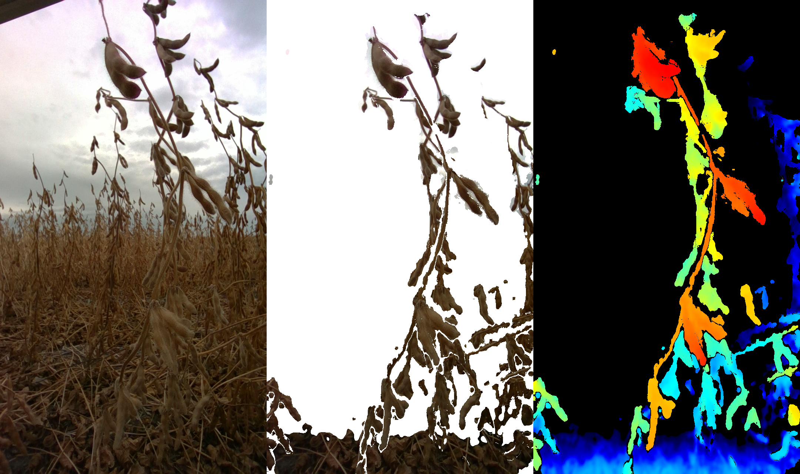
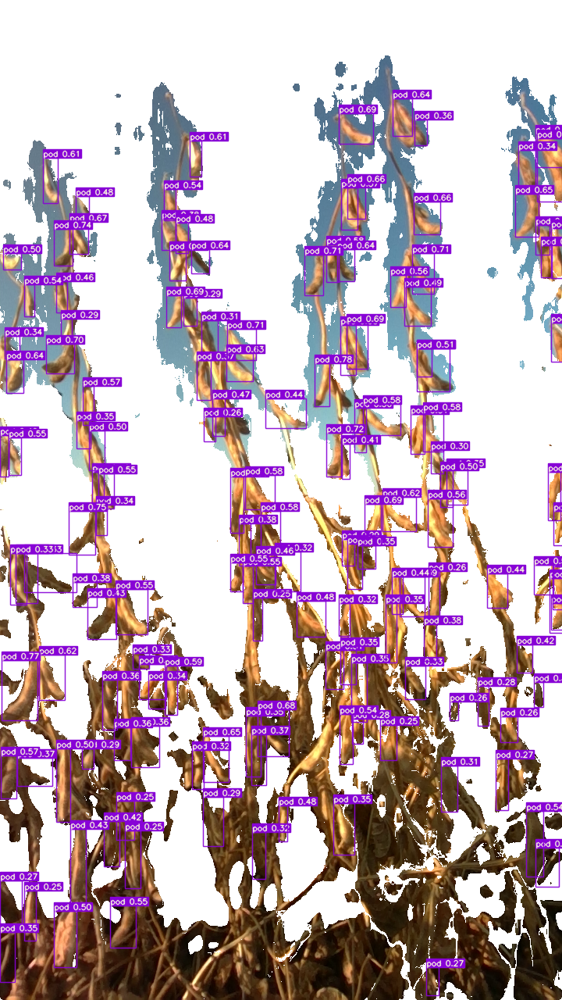
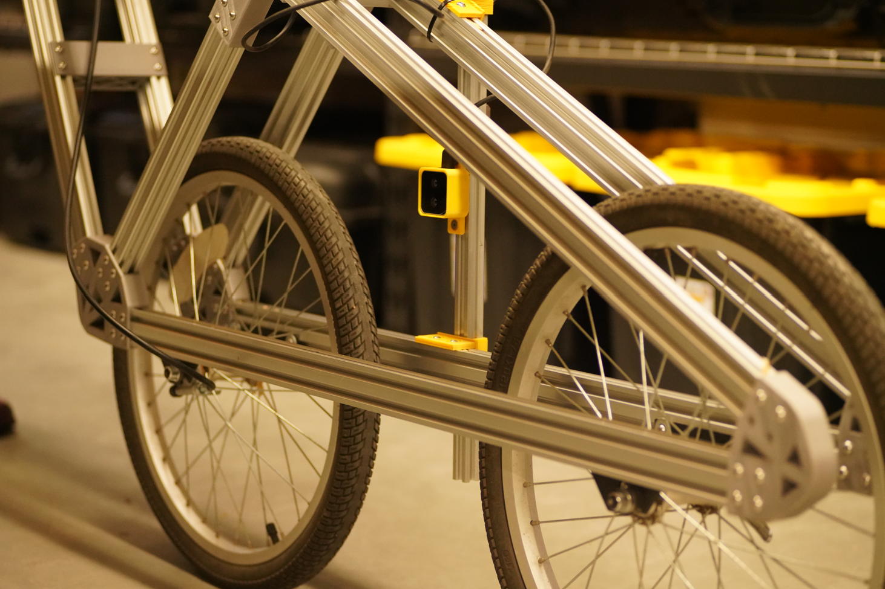
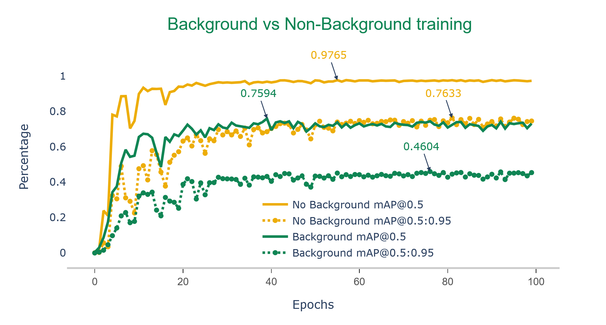

# Soybean pod count using Depth segmentation approach (project 2022)

<a href="https://www.mdpi.com/1424-8220/23/14/6506#:~:text=The%20results%20of%20this%20study,from%20a%20large%20number%20of">
         
</a>

<p>Enhancing soybean yield (scientific name: <em>Glycine max</em> L. (<em>Merr.</em>)) is crucial for strengthening national food security. To achieve this, accurately predicting soybean yield before crop maturity is essential. However, traditional methods often face challenges in estimating yield due to issues with the background color of the crops.</p>

<p>In order to overcome this challenge, we investigated the use of a depth camera to filter RGB images in real-time, aiming to improve the performance of the pod-counting classification model. Furthermore, we compared different object detection models, such as YOLOV7 and YOLOv7-E6E, to select the most suitable deep learning (DL) model for accurately counting soybean pods.</p>

<p>After identifying the optimal architecture, we conducted a comparative analysis of the DL model's performance by training it with and without background removal from the images. The results showed that using a depth camera to remove the background significantly improved the pod detection performance of YOLOv7, increasing precision by 10.2%, recall by 16.4%, mAP@50 by 13.8%, and mAP@0.5:0.95 score by 17.7% compared to when the background was present.</p>

<p>By employing the depth camera and the YOLOv7 algorithm for pod detection and counting, we achieved a mAP@0.5 of 93.4% and mAP@0.5:0.95 of 83.9%. These findings clearly demonstrate the substantial enhancement in the DL model's performance when the background was segmented and a reasonably larger dataset was utilized for training YOLOv7.</p>

### Methods used:
- Depth segmentation
- Object detection
- Pod counting

<!--
<div align="center">
    
</div>

- Figure (a): RGB image collected with a depth camera in the soybean field. Figure (b): The depth image represents color intensity based on the distance of objects from the camera. Closer objects are shown in red, while farther objects are shown in blue.Figure (c): All objects captured in the RGB image that are farther than 50 cm are removed. </figcaption>

<div align="center">
  
</div>
- Comparison of soybean pod detection accuracy using YOLOv7 trained on primary dataset
-->

### Platform
  <p>The camera was mounted on a platform at a height of 44.4 cm from ground level to ensure that the full length of the soybean plants was captured in each frame. The sensor placement on the platform remained consistent throughout the data collection, maintaining the same camera angle and field of view for all images. The platform was manually moved across the field during data collection, and image capturing was automated using a Python v3.9.11 script.</p>

<div align="center">
  
</div>

### Training comparison
  <p>The comparison between the model trained on the primary dataset (35,082 images) and the no-background dataset (1000 images) shows a clear difference in the model's performance when testing on a new, unseen dataset. It can be concluded that a larger training dataset greatly improves both the model's accuracy and its overall generalization ability. The YOLOv7 model trained on the primary dataset demonstrates a 5% improvement in precision, an 11.1% increase in recall, a 4.2% improvement in mAP@50, and a 15.4% increase in mAP@50:95 compared to the model trained on the 1000-image dataset. Although the training time for YOLOv7 significantly increases with a larger dataset, the improvement in detection performance justifies the extra time spent on training the model.</p>

<!--
<div align="center">
  
</div>
-->

### applications: 
- Soybean breeding program (to pick the high-yielding variety)
- Yield estimation in-field conditions

### Citation:
```
@article{mathew2023novel,
  author = {Mathew, J. and Delavarpour, N. and Miranda, C. and Stenger, J. and Zhang, Z. and Aduteye, J. and Flores, P.},
  title = {A Novel Approach to Pod Count Estimation Using a Depth Camera in Support of Soybean Breeding Applications},
  journal = {Sensors},
  year = {2023},
  volume = {23},
  issue = {14},
  pages = {6506},
  doi = {10.3390/s23146506}
}
```

